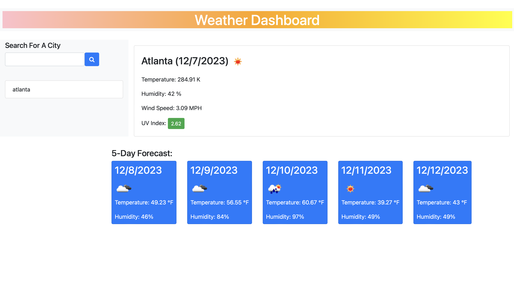

# weatherDashboard

## Description 
This is an application that can give you the 5 day weather forecast for any city of your choosing. It pulls the weather info from an API and displays on the page. It will tell you the day, temp, humidity, wind speed, and UV index. The UV index is color coded based off of if it is a dangerous index or not. 

## Table of Contents

* [Installation](#installation)
* [Usage](#usage)
* [Credits](#credits)
* [License](#license)

## Installation

All you have to do it click the link and type in a city!

## Usage 

Once you click the link add a city of your choosing and press the search icon. It will show you the 5 day forecast and it will save any previous searches. To get to the previous searches just click on the name of that city on the left side of the screen

## Credits

I used a weather API 
https://openweathermap.org/forecast5

## License

MIT License